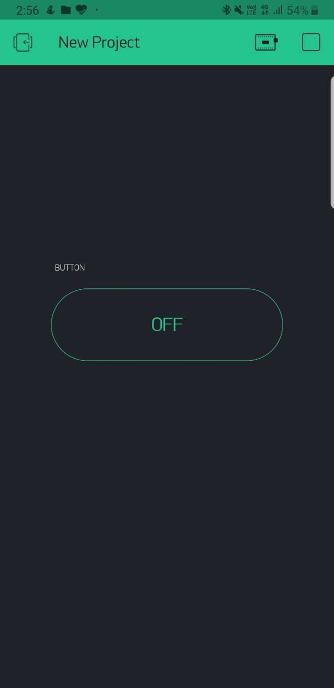

# Home-Automation-using-IOT
Home Automation Project using NodeMCU and Relay module.

### LINK TO MY VIDEO : https://youtu.be/3K_Lts9pq3o

In this project, we are going to build a home light controlling system using the Wi-Fi network or Internet (Mobile data). Using this project we are able to control our home light from anywhere in the world. In this project, we will use Wi-Fi Node MCU, 4 Channel Relay module, etc.

## Hardware Requirements
1.	Wi-Fi Node MCU ESP8266
2.	Standard USB cable to connect Node MCU
3.	4 Channel Relay module (5V)
4.	Jumper wires female to female
5.	Home Light (Bulb)
6.	Bulb holder
7.	Wire
8.	AC 220v/120v home appliances or 9v Hi-Walt Battery

## Software requirements
1.	Arduino software
2.	Blynk app

Working principle of this project (Node MCU, Relay Module)
In this project, there are three main components used an Android Blynk app, Wi-Fi Node MCU and 4 Channel Relay module.

The Android Blynk app sends the serial data to the Wi-Fi Node MCU by clicking ON button. The Wi-Fi Node read the input data and process it according to program uploaded inside it and generate the output to 4 Chanel Relay Module. When the Blynk app's button turns on, it turns ON the home light, and when the Blynk app's buttons turns OFF, it turns OFF the home light.

Download the Blynk application from play store and install it on your device.

